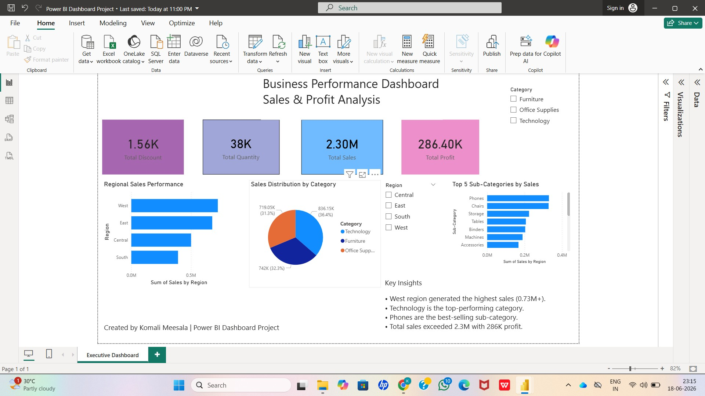

# Business Performance Dashboard

## Overview
This Power BI dashboard analyzes business performance using sales, profit, quantity, and discount metrics from the Superstore dataset.

## Tools Used
- Power BI
- Power Query
- DAX
- Excel

## Dashboard Features
- Total Sales KPI
- Total Profit KPI
- Total Quantity KPI
- Total Discount KPI
- Regional Sales Analysis
- Sales Distribution by Category
- Top 5 Sub-Categories by Sales
- Interactive Filters

## Key Insights
- West region generated the highest sales.
- Technology is the top-performing category.
- Phones are the best-selling sub-category.
- Total sales exceeded 2.3M with 286K profit.

## Dashboard Preview

